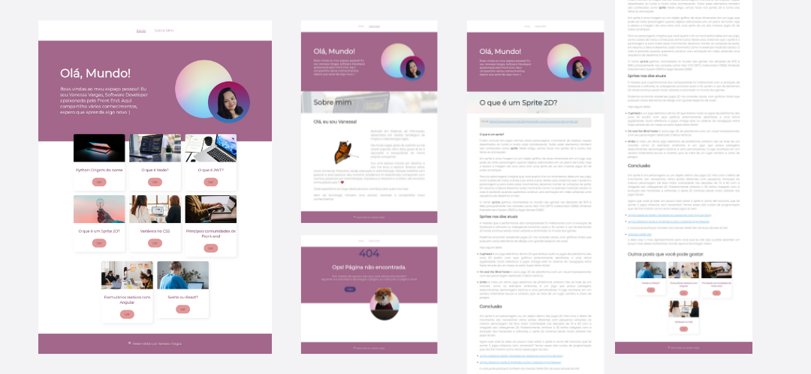

# Projeto Blog

Este é um projeto desenvolvido em ReactJS, com base no curso "React: Desenvolvendo com React Router em JavaScript" da Alura. Foram realizadas algumas personalizações no layout. Os diferenciais em relação ao curso incluem a criação do projeto com o uso do Vite e a estilização com o pré-processador Sass. Além disso, foi adotada a metodologia BEM para padronizar a nomenclatura das classes.

## Layout

    

O projeto está implantado na Netlify, e você pode visualizá-lo [aqui](https://site-blog-react.netlify.app/)

### Conhecimentos trabalhados

Durante o desenvolvimento deste projeto, foram abordados os seguintes conhecimentos:

- Single Page Application (SPA) com react-router-dom;
- Rotas aninhadas;
- Utilização da biblioteca react-markdown para transformar texto em markdown para HTML;
- Utilização dos hooks `useLocation`, `useParams` e `useNavigate`.

    Desenvolvido com ❤️ por VanessaVargas

